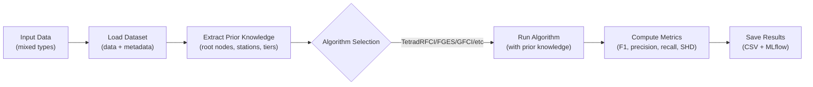

## ACD SEA: Causal Discovery for Mixed-Type Manufacturing Data

### Overview
This repository explores and evaluates causal discovery algorithms for manufacturing datasets that contain mixed data types, as defined via dataset configuration files. Our goals are:

- Build a reproducible benchmark across multiple causal discovery frameworks (e.g., Py-Tetrad)
- Incorporate post-hoc graph pruning using background knowledge via a CausalAssembly workflow
- Provide an inference pipeline that is data-type agnostic so algorithms are “plug-and-play”

### Key Capabilities
- Mixed-type dataset support (categorical, discrete, and continuous) specified in config
- Pluggable causal discovery algorithms from multiple frameworks
- Post-hoc pruning powered by background knowledge and domain constraints
- Data-type agnostic inference pipeline with a consistent interface

### Frameworks and Algorithms
- Py-Tetrad (wrappers for Tetrad algorithms such as FGES, RFCI)
- Extensible registry to add new algorithms with minimal integration overhead

### Prior Knowledge Integration 🎯
Our inference pipeline supports **background knowledge constraints** extracted from dataset metadata to improve causal discovery accuracy. Prior knowledge integration is available for all PyTetrad algorithms:

- **Root Node Constraints**: Prevents incoming edges to root nodes (variables with no causes)
- **Temporal Ordering**: Enforces station-wise precedence (nodes in later stations cannot cause earlier station nodes)
- **Forbidden/Required Edges**: Explicit edge constraints from domain knowledge
- **Tier Ordering**: Multi-tier temporal constraints for complex manufacturing processes

**Usage:**
```bash
# Run with prior knowledge
python inference_pipeline/main.py --use-prior-knowledge

# Run specific algorithms with prior knowledge
python inference_pipeline/main.py --use-prior-knowledge --algorithms TetradRFCI TetradFGES

# Or configure in config.py
USE_PRIOR_KNOWLEDGE = True
```

See `inference_pipeline/PRIOR_KNOWLEDGE_README.md` for detailed documentation.

### Repository Structure
- `data_generator/`: Synthetic data generation utilities and entry points
- `inference_pipeline/`: Config-driven, data-type agnostic pipeline and algorithm wrappers
- `categorical_datasets/`, `causal_meta_dataset/`: Example datasets and metadata (large raw arrays excluded via .gitignore)
- `demo_results/`, `causal_discovery_results2/`: Example outputs and summaries
- Top-level tests: sanity checks and integration tests for the pipeline and algorithms

### Getting Started

#### Quick Start: CSuite Workflow

For CSuite dataset experiments, see **[CSuite_WORKFLOW.md](CSuite_WORKFLOW.md)** for the complete guide.

**Quick commands:**
```bash
# Use the unified orchestrator
python run_csuite_pipeline.py generate    # Step 1: Generate datasets
python run_csuite_pipeline.py run         # Step 2: Run experiments
python run_csuite_pipeline.py analyze     # Step 3: Analyze results
python run_csuite_pipeline.py all         # Run full pipeline

# Or check current status
python run_csuite_pipeline.py status
```

#### Detailed Setup

1) Environment
```bash
python -m venv .venv
. .venv/Scripts/activate  # Windows PowerShell: .venv\Scripts\Activate.ps1
pip install -r requirements.txt
```

2) Run the inference pipeline
```bash
python -m inference_pipeline.main 
```
Optional flags and configuration are defined in `inference_pipeline/config.py`. Datasets and their metadata/configs live under `categorical_datasets/` and `causal_meta_dataset/`.

3) Generate data (optional)
```bash
python data_generator\main.py
```

### Usage Examples

**Basic Usage:**
```bash
# Run all algorithms on all datasets
python inference_pipeline/main.py

# Run with prior knowledge enabled
python inference_pipeline/main.py --use-prior-knowledge

# Run specific algorithms only
python inference_pipeline/main.py --algorithms TetradRFCI TetradFGES

# Specify custom input/output directories
python inference_pipeline/main.py --input-dir my_datasets --output-dir my_results
```

**Configuration:**
Configuration is in `inference_pipeline/config.py`:
```python
INPUT_DIR = "causal_meta_dataset"  # Input directory
OUTPUT_DIR = "causal_discovery_results2"  # Output directory
USE_PRIOR_KNOWLEDGE = False  # Default prior knowledge setting
```

See `inference_pipeline/main.py --help` for all available options.

### Supported Algorithms
All PyTetrad algorithms are supported with prior knowledge integration:
- **TetradRFCI**: Really Fast Causal Inference
- **TetradFGES**: Fast Greedy Equivalence Search
- **TetradGFCI**: Greedy Fast Causal Inference
- **TetradCPC**: Conservative PC algorithm
- **TetradCFCI**: Conservative FCI algorithm
- **TetradFCI**: Fast Causal Inference
- **TetradFCI-Max**: FCI with max orientation

Each algorithm automatically handles:
- Mixed data types (categorical, discrete, continuous)
- Appropriate independence tests based on data types
- Prior knowledge constraints when enabled

### Pipeline Diagram


### Results and Evaluation

Results are saved to `causal_discovery_results2/causal_discovery_analysis.csv` with comprehensive metrics:
- **F1 Score**: Harmonic mean of precision and recall
- **Precision**: Proportion of correct edges among discovered edges
- **Recall**: Proportion of true edges that were discovered
- **SHD**: Structural Hamming Distance from true graph
- **Unified Score**: Combined metric balancing SHD and F1

**Analyze results:**
```bash
# Run detailed analysis
python inference_pipeline/analyze_results.py

# View summary statistics
python inference_pipeline/analyze_results.py --output results_summary.txt
```

### Roadmap
- ✅ Prior knowledge integration for all PyTetrad algorithms
- ✅ Manufacturing-specific data generation with station information
- ✅ Comprehensive metrics and evaluation framework
- 🚧 Additional algorithm wrappers (TXGES, PC, GES)
- 🚧 Soft constraints and probabilistic prior knowledge
- 🚧 Real-world manufacturing datasets integration

### Contributing
Issues and pull requests are welcome. Please lint and add tests where appropriate. Large generated files are ignored by `.gitignore` (e.g., raw arrays, MLflow runs, wheels, local virtualenvs).

### License
TBD (add your license of choice, e.g., MIT or Apache-2.0).


