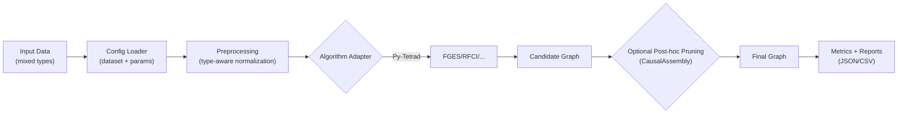

## ACD SEA: Causal Discovery for Mixed-Type Manufacturing Data

### Overview
This repository explores and evaluates causal discovery algorithms for manufacturing datasets that contain mixed data types, as defined via dataset configuration files. Our goals are:

- Build a reproducible benchmark across multiple causal discovery frameworks (e.g., Py-Tetrad)
- Incorporate post-hoc graph pruning using background knowledge via a CausalAssembly workflow
- Provide an inference pipeline that is data-type agnostic so algorithms are “plug-and-play”

### Key Capabilities
- Mixed-type dataset support (categorical, discrete, and continuous) specified in config
- Pluggable causal discovery algorithms from multiple frameworks
- Post-hoc pruning powered by background knowledge and domain constraints
- Data-type agnostic inference pipeline with a consistent interface

### Frameworks and Algorithms
- Py-Tetrad (wrappers for Tetrad algorithms such as FGES, RFCI)
- Extensible registry to add new algorithms with minimal integration overhead

### Post-hoc Pruning with Background Knowledge
After an algorithm proposes a causal graph, we optionally refine it using background knowledge and domain constraints. This pruning step leverages a CausalAssembly-style flow to:
- Remove edges forbidden by known constraints
- Enforce required adjacencies/orientations when specified
- Improve precision by filtering spurious edges discovered under noise or domain shifts

### Repository Structure
- `data_generator/`: Synthetic data generation utilities and entry points
- `inference_pipeline/`: Config-driven, data-type agnostic pipeline and algorithm wrappers
- `categorical_datasets/`, `causal_meta_dataset/`: Example datasets and metadata (large raw arrays excluded via .gitignore)
- `demo_results/`, `causal_discovery_results2/`: Example outputs and summaries
- Top-level tests: sanity checks and integration tests for the pipeline and algorithms

### Getting Started
1) Environment
```bash
python -m venv .venv
. .venv/Scripts/activate  # Windows PowerShell: .venv\Scripts\Activate.ps1
pip install -r requirements.txt
```

2) Run the inference pipeline
```bash
python -m inference_pipeline.main 
```
Optional flags and configuration are defined in `inference_pipeline/config.py`. Datasets and their metadata/configs live under `categorical_datasets/` and `causal_meta_dataset/`.

3) Generate data (optional)
```bash
python data_generator\main.py
```

### Usage Examples
- Run with a categorical demo dataset and default config
```bash
python -m inference_pipeline.main \
  --dataset_dir categorical_datasets/dataset_000 \
  --config_path inference_pipeline/config.py \
  --algorithm fges \
  --framework py-tetrad
```

- Run with a mixed-type meta dataset (config-defined) and RFCI
```bash
python -m inference_pipeline.main \
  --dataset_dir causal_meta_dataset/dataset_000_config_000 \
  --config_path inference_pipeline/config.py \
  --algorithm rfci \
  --framework py-tetrad
```

- Enable post-hoc pruning with background knowledge
```bash
python -m inference_pipeline.main \
  --dataset_dir causal_meta_dataset/dataset_000_config_000 \
  --config_path inference_pipeline/config.py \
  --algorithm fges \
  --framework py-tetrad \
  --prune_with_background true \
  --background_path path/to/background_constraints.json
```


Note: The exact flags may evolve; see `inference_pipeline/config.py` and `inference_pipeline/main.py` for authoritative options.

### Data-Type Agnostic Design
The pipeline normalizes inputs and delegates type-specific handling to algorithm adapters. Each algorithm implements a small interface (fit/evaluate/serialize) so that adding a new method generally requires:
- Writing an adapter in `inference_pipeline/utils/algorithm_registry.py`
- Optionally exposing hyperparameters via `inference_pipeline/config.py`

### Pipeline Diagram


### Results and Evaluation
- Example outputs are saved under `demo_results/` and `causal_discovery_results2/`
- Summary statistics (e.g., precision/recall on adjacency/orientation) are produced as CSV/JSON artifacts for analysis

### Roadmap
- Expand background-knowledge formats (soft constraints, priors)
- Broaden algorithm coverage (score-based, constraint-based, hybrid, neural)
- Add more real-world manufacturing datasets and noise/intervention regimes

### Contributing
Issues and pull requests are welcome. Please lint and add tests where appropriate. Large generated files are ignored by `.gitignore` (e.g., raw arrays, MLflow runs, wheels, local virtualenvs).

### License
TBD (add your license of choice, e.g., MIT or Apache-2.0).


